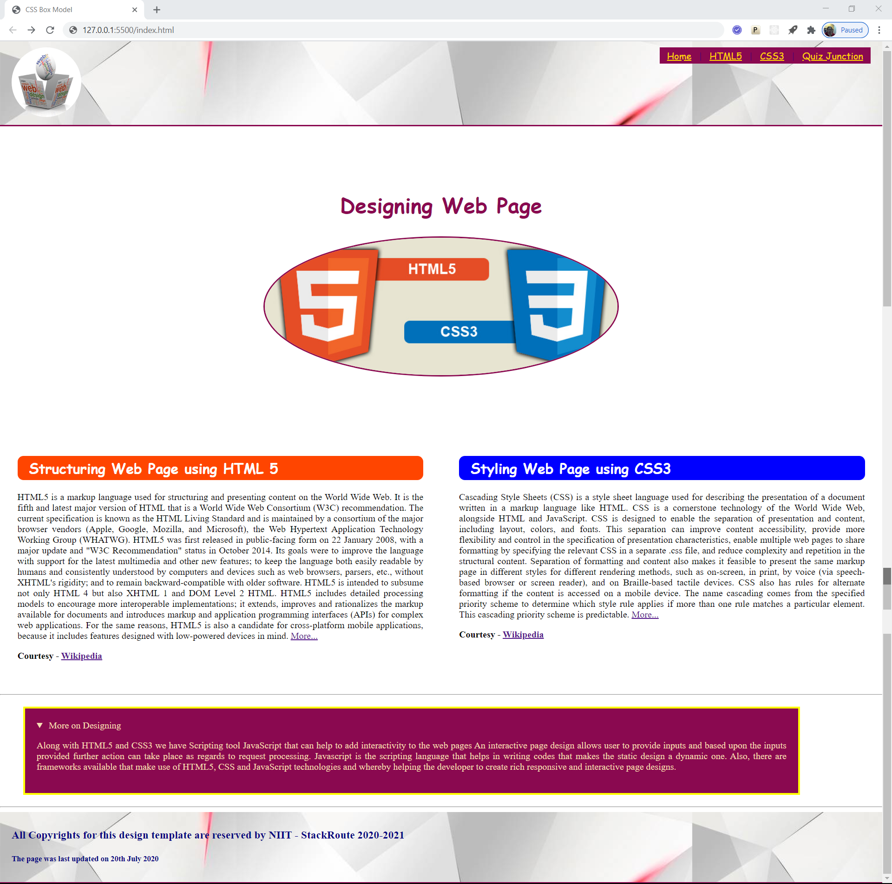

# Sprint 1 - Practice 4
***Build and Deploy an HTML 5 Application -> Applying CSS Box Model Properties***

## Objective
**To design web document providing information about usage of HTML5 and CSS3 in Web Page Design**

### Expected Outcome

Follow the template shown below for designing the web page

### Design Requirements

- The page should be designed based on Web 2.0 standards using semantic HTML5 elements and CSS style properties
- Page should have a meaningful title
- This practice is an extension to Practice 3
- Based upon the template shared, each element on the page has to be styled using CSS style properties
- Usage of Box model properties is suggested.
- For eg.
    - The size of the element can be controlled by width and height properties
    - Spacing between the elements can be controlled by margin property
    - The spacing between the edge and contents of the element can be controlled by padding property
    - Wherever required float property can be used to align the element
- Ensure elements do not overlap each other

### Design Guidelines

- Across all sections of page, harmony in terms of color, font, spacing and alignment should be maintained
- Page should not allow horizontal scrolling
- Images provided in boilerplate should only be used
- Adhere to the files and folder structure provided with the boilerplate

### Code Quality Guidelines
- Usage of HTML5 semantic elements is intended in designing the structure
- Usage of CSS3 style properties is intended for styling page design
- Inline and Embedded styles should not be used
- No 3rd Party frameworks should be used for designing purpose
- Code should be well structured with proper spacing and indentation
- Meaninful names should be given to element ids and css classes
- Naming conventions should be followed
- Use Web 2.0 fonts only
- No deprecated code should be used

### Instructions to Build Solution
- [Click here](https://gitlab.stackroute.in/stack_html_css_bootstrap/practice/applying_css_box_model_properties_starting_source) and download the starter code available in zipped format
- Unzip the .zip file and extract the starter code files
- Launch Visual Studio Code and open the contents of starter code
- Develop the solution code for the practice by referring to the instructions given in Problem.md file
- Keep saving the work frequently
- Test the output through Live Server only

### Project Structure

    📦04_Practice
     ┣📂css
     ┃ ┣📜styles.css
     ┣📂images
     ┃ ┣📜page-template.png
     ┃ ┣📜logo.png
     ┃ ┗📜section-image.jpg
     ┣📜index.html
     ┗📜Problem.md

---
### ALL THE BEST 
---